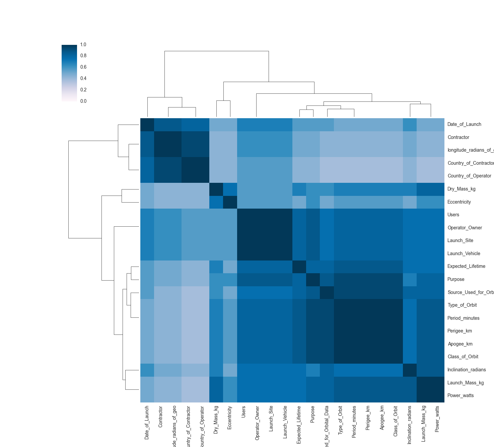
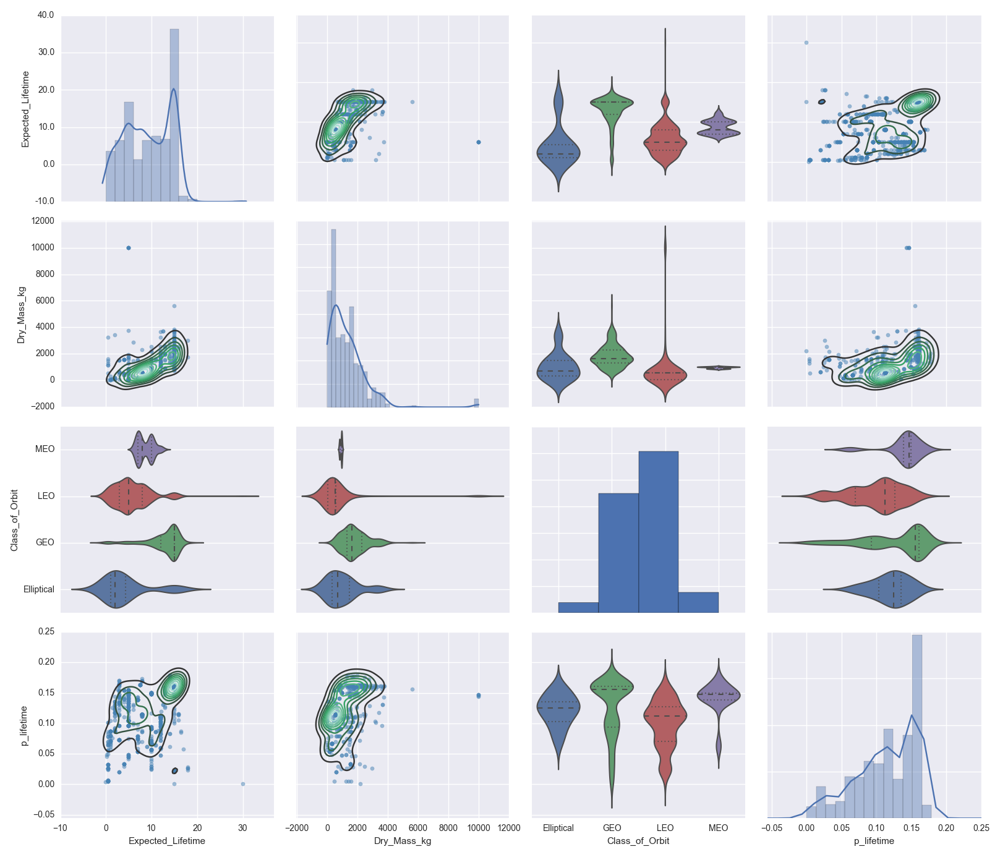
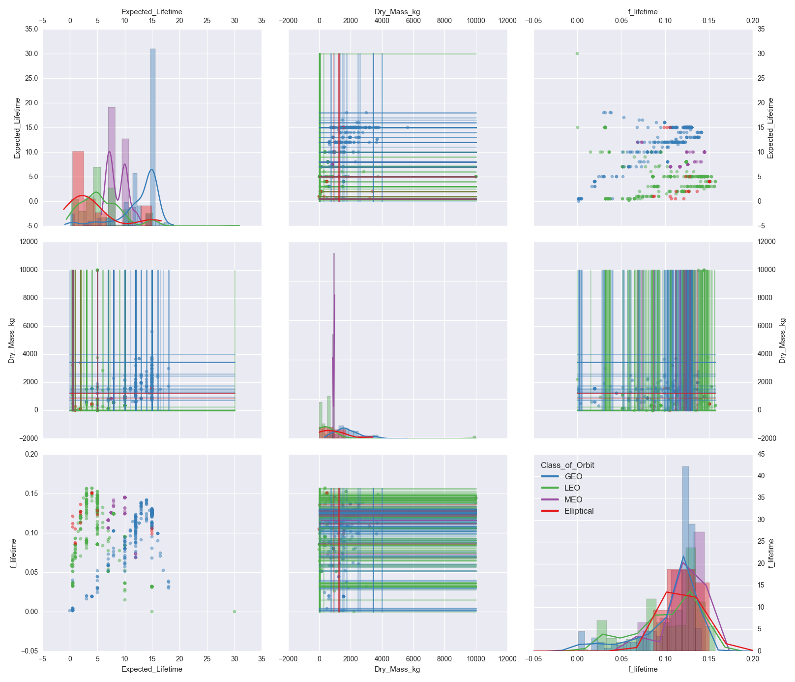
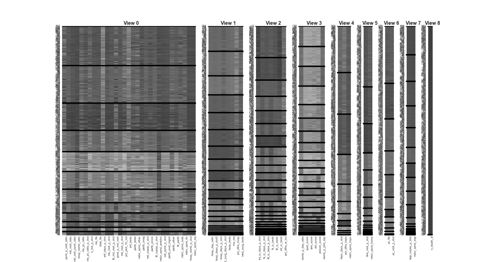
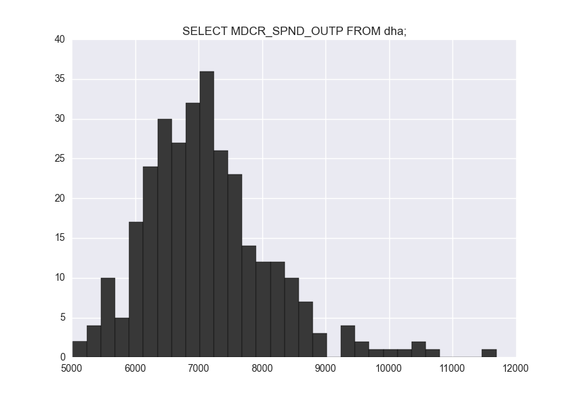
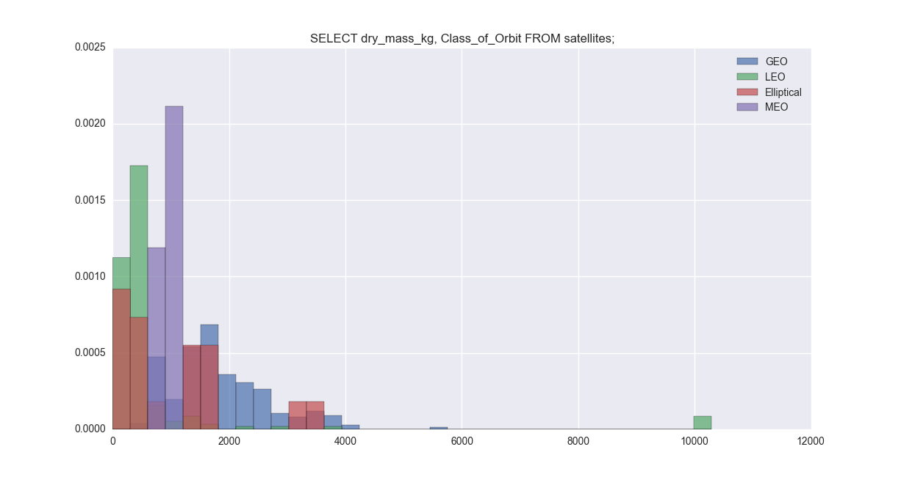
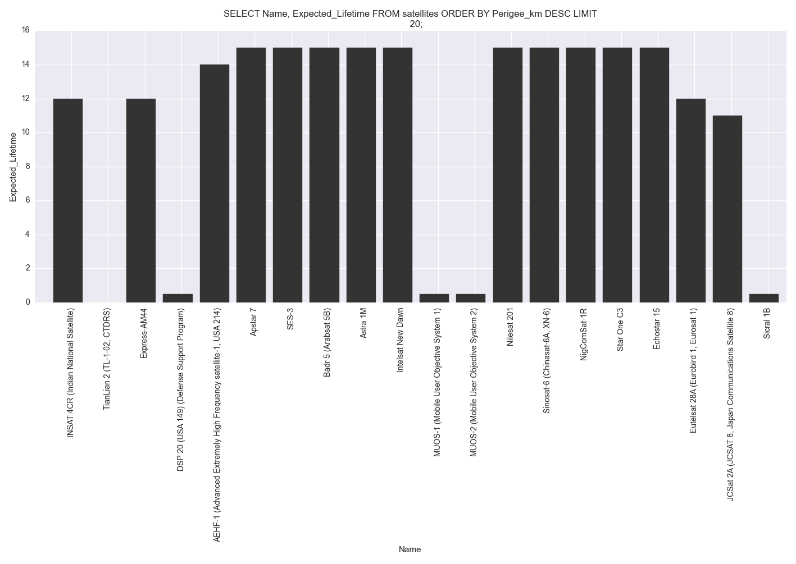

# bdbcontrib

A set of utilities for bayesdb.


## Installing
**Requires**

- Matplotlib
- Seaborn
- Pandas
- numpy
- markdown2 (for `.readtohtml`)
- sphinx (for documentation)
- numpydoc (for documentation)

Clone the repo and add it to your `PYTHONPATH`

## Install
Clone the repo and add the `bdbdcontrib` path to your `PYTHONPATH`

**Linux**
```
$ git clone https://github.com/mit-probabilistic-computing-project/bdbcontrib.git
$ cd bdbcontrib
$ echo export PYTHONPATH=\$PYTHONPATH:`pwd` >> ~/.bashrc
```

**OSX**
```
$ git clone https://github.com/mit-probabilistic-computing-project/bdbcontrib.git
$ cd bdbcontrib
$ echo export PYTHONPATH=\$PYTHONPATH:`pwd` >> ~/.bash_profile
```

**Automatically hooking the contrib**

The contrib is split into several files. You can `.hook` individual contrib
files in the usual way, or to ensure that the entire contrib is automatically
loaded by the shell, add the following to your `~/.bayesliterc` file

    .hook /absolute/path/to/contrib_math.py
    .register_bql_math_functions
    .hook /absolute/path/to/contrib_plot.py
    .hook /absolute/path/to/contrib_util.py

which hooks the contrib files and calls `.register_bql_math_functions`, which
adds additional math functions to BQL.

## Documentation

The python documentation is built using [sphinx](http://sphinx-doc.org/) and
[numpydoc](https://pypi.python.org/pypi/numpydoc).

```
$ cd doc && make html
```

Documentation for the shell can be found below and by using the `.help`
command from within the shell.


## Use

### Shell utilities

All contrib commands have documentation available using the `.help` commands. E.g., `.help show`.

#### .heatmap

    .heatmap <pairwise query> [options]

**Options:**
- `-f, --filename <str>`: save as filename.

Example:

    bayeslite> .heatmap ESTIMATE PAIRWISE DEPENDENCE PROBABILITY FROM satellites_cc;



#### .show
Draws or saves a plot of an arbitrary BQL query

    .show <query> [options]

**Options:**
- `-g, --generator <str>`: the generator name (decreases guesswork with respect to which columns are
    which data types)
- `-f, --filename <str>`: save as filename.
- `-s, --shortnames`: use columns short names (requires codebook) on axis labels.
- `-m, --show-missing`: Plot partial missing values as lines across their missing dimension.
- `--no-countour`: Turn of contours.
- `--colorby`: The name of a columns to use as a marker variable for color.

Example:

    bayeslite> CREATE TEMP TABLE predprob_life AS
          ...>     ESTIMATE Name, Expected_Lifetime,
          ...>         PREDICTIVE PROBABILITY OF Expected_Lifetime AS p_lifetime, Class_of_Orbit
          ...>     FROM satellites_cc;
    bayeslite> .show SELECT Expected_Lifetime, dry_mass_kg, class_of_orbit, p_lifetime FROM predprob_life 



    bayeslite> .show 'SELECT Expected_Lifetime, dry_mass_kg, class_of_orbit, p_lifetime FROM predprob_life' -m --no-contour --colorby Class_of_orbit



#### .ccstate
Draws a crosscat state

    .ccstate <generator> <modelno> [options]

**Options:**
- `-f, --filename <str>`: save as filename.

Example:

    bayeslite> .ccstate dha_cc 0



#### .histogram
Draws a histogram for a one or two-column query. The second column in a
two-column query is assumed to be a dummy variable use to divide the data
into categories.

    .histogram <query> [options]

**Options:**
- `--normed`: normalize the histogram
- `-b, --bins <int>`: the number of bins
- `-f, --filename <str>`: save as filename.

Example (one-column query):

    bayeslite> .histogram SELECT MDCR_SPND_OUTP FROM dha; --normed --bins 31



Example (two-column query):

    bayeslite> .histogram SELECT dry_mass_kg, Class_of_Orbit FROM satellites; -b 35 --normed



#### .bar
Bar plot of a two-column query. The first column of the query is used as the
bar labels; the second column of the query is used as the bar heights. All
other columns in the query are ignored.

    .bar <query> [options]

**Options:**
- `-f, --filename <str>`: save as filename.

Example

    bayeslite> .bar 'SELECT Name, perigee_km FROM satellites ORDER BY Expected_Lifetime DESC;'



#### .chainplot
Plots various model diagnostics as a function of iterations. To use `.chainplot`, `ANALYZE` must
be run with `CHEKPOINT`.

    .chainplot <logscore|num_views|column_crp_alpha> <generator> [filename]

Example:

    bayeslite> ANALYZE satellites_cc FOR 50 ITERATIONS CHECKPOINT 2 ITERATION WAIT;
    bayeslite> .chainplot logscore satellites_cc


